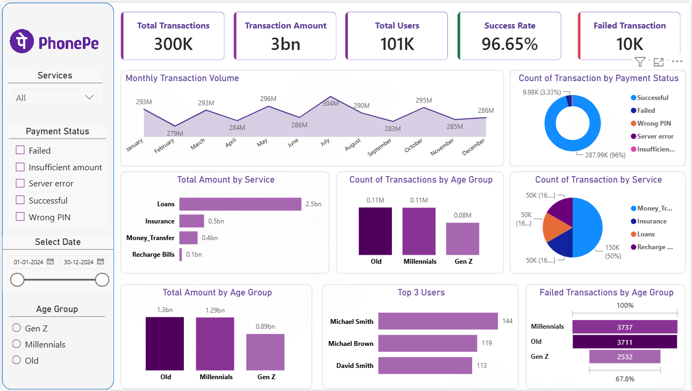

# 📊 PhonePe Transaction Analysis Dashboard

## 📌 Project Overview

This project presents an interactive Power BI dashboard designed to analyze
transaction performance, user behavior, payment status, service performance,
and failed transactions.

The dashboard converts raw transaction data into meaningful business insights
using Power BI.

## 🎯 Objectives

- Analyze overall transaction performance
- Monitor transaction success and failure rates
- Analyze monthly transaction volume
- Compare transaction amounts across services
- Understand transaction behavior across age groups
- Identify top users
- Analyze failed transactions by age group and payment status

## 📊 Key KPIs

| KPI | Value |
|---|---:|
| Total Transactions | 300K |
| Transaction Amount | 3B |
| Total Users | 101K |
| Success Rate | 96.65% |
| Failed Transactions | 10K |

## 📈 Dashboard Analysis

### 1. Monthly Transaction Volume
Shows the monthly trend of transaction volume throughout the year.

### 2. Transaction by Payment Status
Analyzes successful, failed, wrong PIN, server error and insufficient amount
transactions.

### 3. Total Amount by Service
Compares transaction amounts across:
- Loans
- Insurance
- Money Transfer
- Recharge Bills

### 4. Transactions by Age Group
Analyzes transaction activity across:
- Gen Z
- Millennials
- Old

### 5. Top Users
Highlights users with the highest number of transactions.

### 6. Failed Transactions by Age Group
Shows failed transaction distribution across different age groups.

## 🛠️ Tools & Technologies

- Power BI
- Power Query
- DAX
- Data Cleaning
- Data Modeling
- Data Visualization
- Microsoft Excel

## 📷 Dashboard Preview

## 💡 Skills Demonstrated

- Data Cleaning
- Data Transformation
- Data Modeling
- DAX Measures
- KPI Development
- Interactive Dashboard Design
- Business Analysis
- Data Visualization
